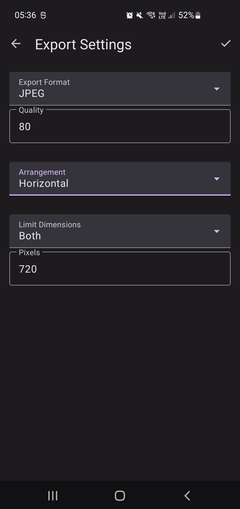

## Stitchy Mobile

Stitchy has been bundled into an Android app, now [published on Google Play](https://play.google.com/store/apps/details?id=com.shininggrimace.stitchy)!

Choose images from your gallery, and stitch them together quickly and easily, using basic
configuration options similar to the Stitchy CLI.

| Input files                 |                             | Configuration               | Output                                    |
|-----------------------------|-----------------------------|-----------------------------|-------------------------------------------|
|  |  |  |  |

#### Development

Contributions to the underlying Stitchy crates are welcome. Please find
[that repository on GitHub](https://github.com/shining-grimace/Stitchy).

Building this Android app has only been tested on an Ubuntu Linux machine, and is set up with some host-specific
configuration. If you would like to run this on your machine, you will need to set up some things:
- Update the signing configuration in `app/build.gradle.kts`, perhaps by removing it entirely
- Install Rust, including the targets `aarch64-linux-android` and `x86_64-linux-android`
- Install the latest Android NDK (tested with `26.1.10909125`)
- Update the paths in `.cargo/config` to point to the corresponding linkers in your NDK installation
